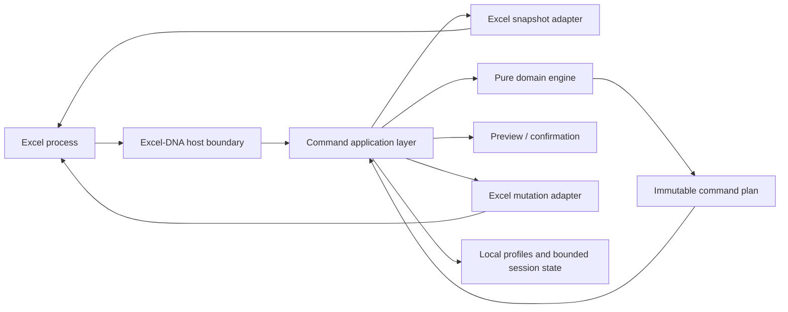

# ExcelAccel architecture

Status: **Active baseline; foundational decisions accepted 2026-08-19**

## 1. Architectural objective

Build a thin, defensive Excel integration layer around a testable command and
domain engine. The add-in runs in Excel's process, so containment, bounded work,
and conservative refusal are more important than feature throughput.

## 2. System context



The arrows are dependency/interaction direction, not permission to pass Excel
objects between components.

## 3. Solution boundaries

The production project names and dependency direction are normative.

| Project | Responsibility | Allowed dependencies |
|---|---|---|
| `ExcelAccel.ExcelAddIn` | Excel-DNA lifecycle, Ribbon, panes, callback boundaries, dispatcher composition | Application, Core, ExcelInterop |
| `ExcelAccel.Application` | Command registry, orchestration, impact policy, preview routing, cancellation, results | Domain and abstractions only |
| `ExcelAccel.Core` | Immutable workbook models, formulas, pure policies, reliability primitives, performance math, and bounded package-integrity primitives | BCL and approved pure libraries only |
| `ExcelAccel.ExcelInterop` | Excel COM/C API snapshots, capability detection, mutation writers, state guard | Application abstractions; Office interop |
| `ExcelAccel.Persistence` | Profiles, settings, schema migration, atomic local files | Core/application DTOs only |
| `ExcelAccel.PresentationInterop` | Deferred PowerPoint automation | Separate optional adapter only |

### Dependency rules

- `Core` MUST NOT reference Excel-DNA, Office interop, UI frameworks, registry
  APIs, network APIs, or Excel process-global state. Its bounded package
  integrity code may use explicit caller-supplied file paths.
- `Application` MUST NOT expose COM types in any public API.
- `ExcelAddIn` and interop adapters MUST remain thin; workbook business rules
  belong in `Core` or `Application`.
- `ExcelInterop` receives the root Excel application and thread verifier from
  host composition; it MUST NOT reference `ExcelAddIn` or own process lifecycle.
- The PowerPoint adapter MUST remain absent until its phase is approved.
- Cyclic project references are prohibited.

## 4. Command lifecycle

Every invocation follows one state machine:

```text
Received
  -> Boundary validation
  -> CanExecute
  -> Capture immutable snapshot
  -> Plan on pure data
  -> Preview if required
  -> Revalidate execution preconditions
  -> Enter Excel application-state guard
  -> Apply exact plan in bounded writes
  -> Verify declared postconditions
  -> Create session receipt when supported
  -> Restore application state
  -> Return explicit result
```

Any exception or cancellation moves to a failure path that attempts bounded
rollback when mutation began, restores owned application state in a
`finally`-equivalent boundary, records a sanitized diagnostic, and returns an
explicit non-success status.

### 4.1 Required command abstractions

- `CommandId`: stable invariant identifier.
- `CommandContext`: workbook and selection identity plus capabilities, never a
  long-lived COM proxy bag.
- `CanExecuteResult`: allowed/refused, reason code, user-safe message, and
  remediation.
- `Snapshot`: immutable plain values captured by the adapter.
- `CommandPlan`: versioned targets, property deltas, warnings, cost estimate,
  preconditions, impact tier, preview data, and undo policy.
- `CommandResult`: status, changed/skipped counts, warnings, timing, diagnostic
  ID, and optional receipt ID.
- `UndoReceipt`: bounded before-state, written post-state, property scope,
  target identity, plan hash, and expiry.

## 5. Threading and process model

- Excel COM/C API calls MUST run on Excel's owning thread through one dispatcher
  abstraction qualified in Phase 0.
- No `Range`, `Workbook`, `Worksheet`, `Chart`, `Application`, PowerPoint proxy,
  or other RCW may enter a worker task, domain object, queue payload, cache, or
  persisted record.
- Background work MAY receive immutable arrays, records, strings, numbers, and
  other plain values copied from a completed snapshot.
- Background completion MUST marshal a plain result back to the Excel thread;
  it MUST revalidate the workbook context before applying anything.
- Cancellation is cooperative. Before commit, cancellation changes nothing.
  During a qualified multi-stage commit, cancellation follows the declared
  rollback policy and cannot abandon the adapter mid-write.
- Event handlers MUST be short, exception-contained, reentrancy guarded, and
  unable to start overlapping mutation pipelines for the same workbook.

## 6. Excel adapter rules

- Read/write rectangular ranges in blocks using the qualified formula/value
  dialect and property batches.
- Avoid chained COM expressions and long-lived proxy graphs.
- Centralize capability detection for build, formula dialect, AutoSave,
  protection, edit mode, coauthoring indicators, workbook format, calculation
  state, and supported object types.
- Snapshot only properties required by the command plan.
- Treat multi-area ranges, merged cells, tables, spills, legacy arrays,
  filtered ranges, protected content, and external objects as explicit cases.
- All mutation methods MUST be idempotence-aware or reject replay.
- Mutation methods MUST return actual changed/skipped targets and never infer
  success from absence of an exception.
- Interop cleanup policy MUST be established by Phase 0 tests; agents MUST NOT
  scatter manual final-release calls or forced garbage collection through
  feature code.

## 7. Application-state guard

The guard owns only state it explicitly captures. The Phase 0 spike determines
which properties can be safely read/restored across supported builds.

Candidate state includes:

- calculation mode and calculation-related state the command changes;
- screen updating;
- event enablement;
- display alerts;
- cursor and status bar ownership;
- cut/copy mode when intentionally changed;
- active workbook, worksheet, selection, and focus when restoration is safe.

Rules:

- nested guards use reference-counted or stack semantics;
- restoration runs on every exit path;
- restoration failures are separately recorded and surfaced;
- restoration MUST NOT overwrite an external state change the guard does not
  own;
- a command cannot report success when required restoration failed.

## 8. Planning, staleness, and transactions

- A plan contains a workbook identity, sheet/object identities, target
  addresses, relevant structure/version fingerprints, and property-level
  preconditions.
- Preview never recomputes targets.
- Before mutation, the adapter rechecks relevant identity and preconditions.
- A stale plan returns `Refused` with `Refresh preview`; it is never silently
  retargeted.
- Operations are atomic where bounded rollback is proven. Otherwise they are
  excluded from the active phase or explicitly classified as non-atomic before
  confirmation.
- Add-in undo uses optimistic property-level validation as defined by
  `ADR-0003`; it is not workbook version control.

## 9. AutoSave and coauthoring boundary

The accepted ADR-0005 policy is deliberately conservative:

- low-impact property-scoped commands may execute after immediate precondition
  revalidation;
- medium-impact commands require a fresh snapshot and receipt eligibility;
- high-impact commands refuse when AutoSave/coauthoring state makes a bounded
  transaction unprovable;
- the add-in MUST NOT silently toggle AutoSave;
- cached workbook state is invalidated aggressively on relevant events;
- no plan remains executable indefinitely; plans have bounded lifetime and
  state fingerprints.

## 10. Persistence

Active-phase persistence is deliberately narrow:

- versioned JSON settings and profiles;
- atomic temp-write, validate, and replace;
- pre-migration backup and deterministic schema migration;
- no workbook-derived formula/value content in profiles;
- session-only undo and navigation/bookmark state;
- bounded sanitized local diagnostics;
- no database, cloud service, hidden worksheet, or workbook custom XML part.

## 11. Startup, shutdown, and recovery

- Startup registers only essential boundaries and commands; panes, parsers,
  indexes, and large catalogs initialize lazily.
- A session marker records startup completion and clean shutdown without
  workbook content.
- If the prior session was unclean during an add-in operation, the next startup
  enters conservative recovery: no automatic pane restore, workbook mutation,
  undo replay, or background scan.
- Event subscriptions, timers, cancellation sources, and pane resources MUST be
  detached during disable/shutdown through bounded cleanup.
- Shutdown MUST NOT wait indefinitely for background work; work is cancelled,
  prevented from re-entering Excel, and abandoned only after it holds no COM
  reference and has no mutation permission.

## 12. Observability

Structured local events may include:

- session/build ID;
- command ID and lifecycle phase;
- duration and workload category/count;
- result and stable failure code;
- state-restoration and rollback outcome;
- sanitized exception type and stack owned by add-in code;
- startup/shutdown/recovery markers.

They exclude workbook names, sheet names, addresses by default, paths, formulas,
values, user-defined names, images, and chart data. Diagnostic export is
user-initiated and manifest-reviewed.

## 13. Packaging and runtime

- Excel-DNA is the proposed host and is recorded in `ADR-0001`.
- The runtime is unresolved in `ADR-0002`; no implementation project should be
  generated before that record is accepted.
- Packages, binaries, and updates MUST be signed before external qualification.
- Clean-machine installation, disable, upgrade, rollback, and uninstall are
  Phase 0/GA test paths, not release-week tasks.

## 14. Architecture enforcement

The future build MUST include checks that fail when:

- an interop assembly reference enters `Domain`;
- a COM proxy is passed to a worker-thread boundary;
- a callback lacks the common exception boundary;
- an unapproved network client enters a core project;
- a large-range path performs an unapproved cell-by-cell COM loop;
- a command mutates outside its declared property set;
- logs contain seeded sensitive workbook tokens;
- a plan is executed after its relevant preconditions changed.
